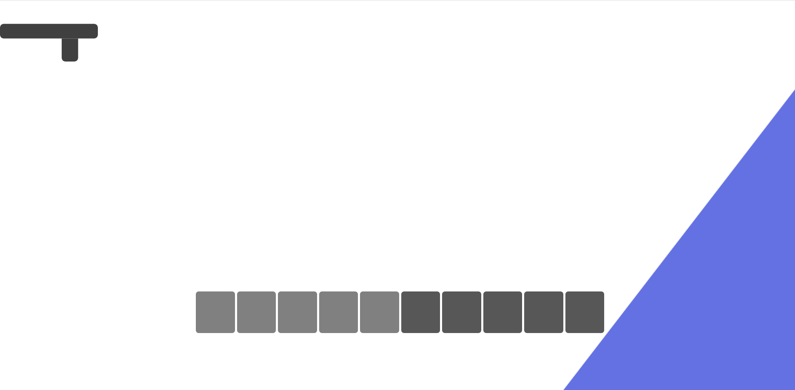
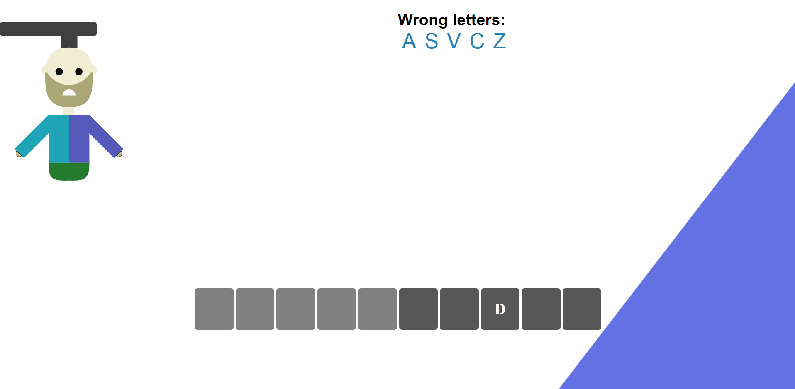
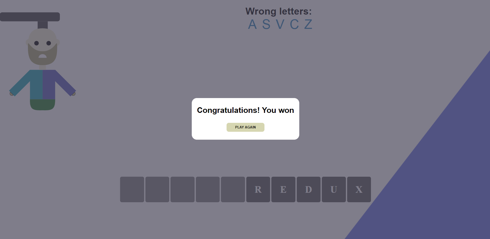
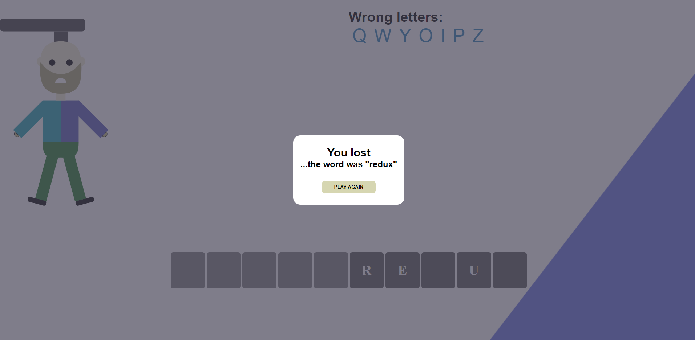

<div align="center">
    
# hangman-game
    
</div>

## Project Overview 🎉

This project was inspired by this [video](https://www.youtube.com/watch?v=iUYfpPjXad4). I wanted to reconstruct the hangman game presented in this video. All images in this app I've made in Figma.

## Tech/framework used 🔧

| Npm packages                                        |               Description                |
| --------------------------------------------------- | :--------------------------------------: |
| [React](https://reactjs.org/)                       |   Library for building user interfaces   |
| [Styled Components](https://styled-components.com/) | Visual primitives for the component age. |

| Graphic design tools            |                 Description                 |
| ------------------------------- | :-----------------------------------------: |
| [Figma](https://www.figma.com/) | Vector graphics editor and prototyping tool |

## Screenshots 📺






## Installation 💾

```bash
git clone https://github.com/Aroniero/hangman.git
npm install
npm run start
```

## Available scripts :scroll:

| Command         | Description            |
| --------------- | ---------------------- |
| `npm run start` | Open local server      |
| `npm run build` | Create optimized build |
| `npm run test`  | Run tests              |
| `npm run eject` | Eject CRA              |
